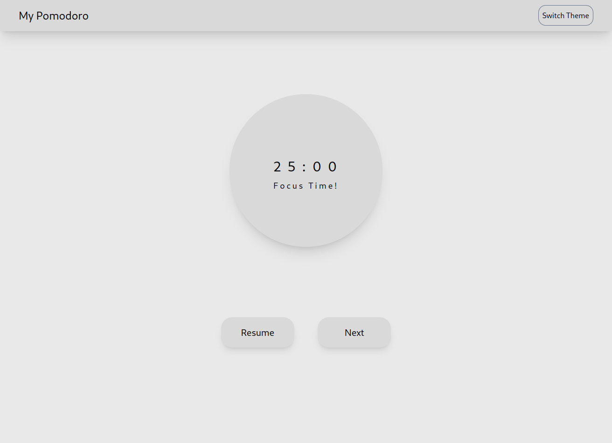
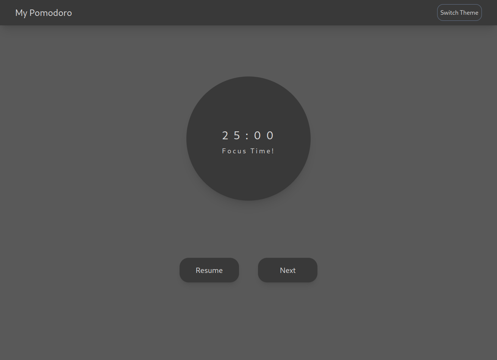

# **My Pomodoro**

## **ARCHIVED**

This project is archived, see it continuation in repo 

<br/>

## **Content**
- [About](#about)
- [Prints](#prints)
- [Specs](#specs)


## **About**

The ***Pomodoro*** technique is a time management method where you work on a task for 25 minutes (called a "Pomodoro") without distractions, followed by a 5-minute break. After four Pomodoros, take a longer break of 15-30 minutes. This technique helps improve focus, productivity, and combat procrastination.

This project is a pomodoro timer, in a minimalist aspect. Runs well in desktop & mobile.

<br/>

## **Prints**

**Light Theme**




**Dark Theme**



<br/>

## **Specs**

This project uses:
- [React](https://react.dev/)
- [Next.js](https://nextjs.org/)
- [Tailwindcss](https://tailwindcss.com/) and [PostCSS](https://postcss.org/)

<br/>

## **Test the project at localhost**

To test this project in local machine, first clone the project:

```sh
git clone https://github.com/brunoan99/my-pomodoro
```

enter the project directory:

```sh
cd my-pomodoro
```

install dependencies:

```sh
npm run install
```

And to run use:

```sh
npm run dev
```

The project will be available in [localhost](https://localhost:3000)

<br/>

## **License**

The project uses a [MIT License](./LICENSE)

Be free to use this as like as you want.
